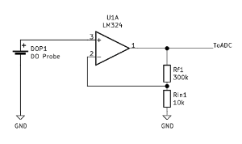

# Dissolved Oxygen Meter

## Hardware
Arduino Uno
LCD Shield
OxyGuard DO Probe
LM124N Operational amplifier (Or any other LMX24N) (datasheet)[https://www.ti.com/lit/ds/symlink/lm324-n.pdf]

## Dissolved Oxygen probe
The OxyGuard is a galvanic cell. Figure out your model (here)[https://www.oxyguard.dk/wp-content/uploads/2020/07/D02-Standard-Probe-brochure-GB-2020-07.pdf]

The one I have is a 4-wire with brown and blue for + and - from the galvanic cell. The NTC is between yellow and black, but not used for now. The output seems to be internally temperature compensated, so the NTC is not necessarily strictly needed. I believe my model is D0234C for mg/l and % saturation measurements.

A membrane keeps water out of the electrolyte solution, this membrane can be replaced.

See patent [4 495 051](https://patentimages.storage.googleapis.com/b0/aa/33/e8c414c19d55d3/US4495051.pdf) for a description of galvanic cell oxygen sensor.

## Circuit

The output is of a few millivolt, proportional to oxygen saturation. We use non-inverting op amp to amplify.

The amplification of LNX24 is based on Rf = 1M and Rin = 8.4k, gain = 119.05
Output voltage = Input voltage * 119.05

Turns out the LM124N cannot take input above Vin-1.5v. We make gain 30 by using a 10k and a 300k.

## Ref
[YSI Handbook](fondriest.com/pdf/ysi_do_handbook.pdf)